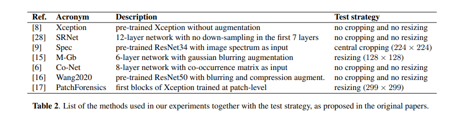

##  Binary Classifier / Deepfake Detector

Mainly based on CNNDetection https://github.com/PeterWang512/CNNDetection

Just test some recent pretrained models, such as ViT, from timm for deepfake detection.

pip install hydra-core --upgrade
pip install lightning


|     Model Name      |Train|Test|
|:-------------------:|:------:|:------:|
|       CNNDet        | |
|      FreDetect      | |
|       GramNet       | |
| GAN Image Detection | |
|       Fusing        | |
|       FreqNet       | |
|        DIRE         | |
|        UniFD        | |
|        LGrad        | |
|         NPR         | |
|        DIMD         | |
|     PatchCraft      | |


## (A) Acknowledgments

This repository borrows partially from the [pytorch-CycleGAN-and-pix2pix](https://github.com/junyanz/pytorch-CycleGAN-and-pix2pix), and the PyTorch [torchvision models](https://github.com/pytorch/vision/tree/master/torchvision/models) repositories. 


#### CNNDet
CNN-generated images are surprisingly easy to spot...for now	
https://github.com/peterwang512/CNNDetection
```
@inproceedings{wang2019cnngenerated,
  title={CNN-generated images are surprisingly easy to spot...for now},
  author={Wang, Sheng-Yu and Wang, Oliver and Zhang, Richard and Owens, Andrew and Efros, Alexei A},
  booktitle={CVPR},
  year={2020}
}
```

#### FreDetect
Leveraging Frequency Analysis for Deep Fake Image Recognition	
https://github.com/RUB-SysSec/GANDCTAnalysis
```
@inproceedings{frank2020leveraging,
  title={Leveraging frequency analysis for deep fake image recognition},
  author={Frank, Joel and Eisenhofer, Thorsten and Sch{\"o}nherr, Lea and Fischer, Asja and Kolossa, Dorothea and Holz, Thorsten},
  booktitle={International conference on machine learning},
  pages={3247--3258},
  year={2020},
  organization={PMLR}
}
```

#### GramNet
Global Texture Enhancement for Fake Face Detection In the Wild	
https://github.com/liuzhengzhe/Global_Texture_Enhancement_for_Fake_Face_Detection_in_the-Wild
```
@inproceedings{liu2020global,
  title={Global texture enhancement for fake face detection in the wild},
  author={Liu, Zhengzhe and Qi, Xiaojuan and Torr, Philip HS},
  booktitle={Proceedings of the IEEE/CVF conference on computer vision and pattern recognition},
  pages={8060--8069},
  year={2020}
}
```


#### GAN Image Detection

Are GAN generated images easy to detect? A critical analysis of the state-of-the-art
https://github.com/grip-unina/GANimageDetection
```
@inproceedings{gragnaniello2021gan,
  title={Are GAN generated images easy to detect? A critical analysis of the state-of-the-art},
  author={Gragnaniello, Diego and Cozzolino, Davide and Marra, Francesco and Poggi, Giovanni and Verdoliva, Luisa},
  booktitle={2021 IEEE international conference on multimedia and expo (ICME)},
  pages={1--6},
  year={2021},
  organization={IEEE}
}
```


#### Fusing
Fusing global and local features for generalized AI-synthesized image detection	
https://github.com/littlejuyan/FusingGlobalandLocal
```
@inproceedings{ju2022fusing,
  title={Fusing global and local features for generalized ai-synthesized image detection},
  author={Ju, Yan and Jia, Shan and Ke, Lipeng and Xue, Hongfei and Nagano, Koki and Lyu, Siwei},
  booktitle={2022 IEEE International Conference on Image Processing (ICIP)},
  pages={3465--3469},
  year={2022},
  organization={IEEE}
}
```

#### LNP


#### FreqNet


#### DIRE
DIRE for Diffusion-Generated Image Detection	
```
@inproceedings{wang2023dire,
  title={Dire for diffusion-generated image detection},
  author={Wang, Zhendong and Bao, Jianmin and Zhou, Wengang and Wang, Weilun and Hu, Hezhen and Chen, Hong and Li, Houqiang},
  booktitle={Proceedings of the IEEE/CVF International Conference on Computer Vision},
  pages={22445--22455},
  year={2023}
}
```

#### UniFD
Towards Universal Fake Image Detectors that Generalize Across Generative Models	
https://github.com/Yuheng-Li/UniversalFakeDetect
```
@inproceedings{ojha2023towards,
  title={Towards universal fake image detectors that generalize across generative models},
  author={Ojha, Utkarsh and Li, Yuheng and Lee, Yong Jae},
  booktitle={Proceedings of the IEEE/CVF Conference on Computer Vision and Pattern Recognition},
  pages={24480--24489},
  year={2023}
}
```

#### LGrad
Learning on Gradients: Generalized Artifacts Representation for GAN-Generated Images Detection	
https://github.com/chuangchuangtan/LGrad
```
@inproceedings{tan2023learning,
  title={Learning on Gradients: Generalized Artifacts Representation for GAN-Generated Images Detection},
  author={Tan, Chuangchuang and Zhao, Yao and Wei, Shikui and Gu, Guanghua and Wei, Yunchao},
  booktitle={Proceedings of the IEEE/CVF Conference on Computer Vision and Pattern Recognition},
  pages={12105--12114},
  year={2023}
}
```

#### NPR
Rethinking the Up-Sampling Operations in CNN-based Generative Network for Generalizable Deepfake Detection	
https://github.com/chuangchuangtan/NPR-DeepfakeDetection
```
@misc{tan2023rethinking,
      title={Rethinking the Up-Sampling Operations in CNN-based Generative Network for Generalizable Deepfake Detection}, 
      author={Chuangchuang Tan and Huan Liu and Yao Zhao and Shikui Wei and Guanghua Gu and Ping Liu and Yunchao Wei},
      year={2023},
      eprint={2312.10461},
      archivePrefix={arXiv},
      primaryClass={cs.CV}
}
```

#### DIMD
On the detection of synthetic images generated by diffusion models.	
https://github.com/grip-unina/DMimageDetection
```
@InProceedings{Corvi_2023_ICASSP,
  author={Corvi, Riccardo and Cozzolino, Davide and Zingarini, Giada and Poggi, Giovanni and Nagano, Koki and Verdoliva, Luisa},
  title={On The Detection of Synthetic Images Generated by Diffusion Models},
  booktitle={IEEE International Conference on Acoustics, Speech and Signal Processing (ICASSP)}, 
  year={2023},
  pages={1-5},
  doi={10.1109/ICASSP49357.2023.10095167}
}
```

#### PatchCraft
PatchCraft: Exploring Texture Patch for Efficient AI-generated Image Detection	


#### DeFake
DE-FAKE: Detection and Attribution of Fake Images Generated by Text-to-Image Generation Models	  
https://github.com/zeyangsha/De-Fake
```
@inproceedings{sha2023fake,
  title={De-fake: Detection and attribution of fake images generated by text-to-image generation models},
  author={Sha, Zeyang and Li, Zheng and Yu, Ning and Zhang, Yang},
  booktitle={Proceedings of the 2023 ACM SIGSAC Conference on Computer and Communications Security},
  pages={3418--3432},
  year={2023}
}
```

#### Rine
Leveraging Representations from Intermediate Encoder-blocks for Synthetic Image Detection	#
https://github.com/mever-team/rine

```


```


#### 

Ai-generated image detection using a cross-attention enhanced dual-stream network
https://github.com/zoie-ui/ai-generated-image-detection

```
@inproceedings{xi2023ai,
  title={Ai-generated image detection using a cross-attention enhanced dual-stream network},
  author={Xi, Ziyi and Huang, Wenmin and Wei, Kangkang and Luo, Weiqi and Zheng, Peijia},
  booktitle={2023 Asia Pacific Signal and Information Processing Association Annual Summit and Conference (APSIPA ASC)},
  pages={1463--1470},
  year={2023},
  organization={IEEE}
}
```

#### D4
D4: Detection of Adversarial Diffusion Deepfakes Using Disjoint Ensembles
https://github.com/nmangaokar/wacv_24_d4
```
@InProceedings{Hooda_2024_WACV,
    author    = {Hooda, Ashish and Mangaokar, Neal and Feng, Ryan and Fawaz, Kassem and Jha, Somesh and Prakash, Atul},
    title     = {D4: Detection of Adversarial Diffusion Deepfakes Using Disjoint Ensembles},
    booktitle = {Proceedings of the IEEE/CVF Winter Conference on Applications of Computer Vision (WACV)},
    month     = {January},
    year      = {2024},
    pages     = {3812-3822}
}
```

#### CLIPping
CLIPping the Deception: Adapting Vision-Language Models for Universal Deepfake Detection
https://github.com/sohailahmedkhan/CLIPping-the-Deception
```
@article{Khan2024CLIPpingTD,
  title={CLIPping the Deception: Adapting Vision-Language Models for Universal Deepfake Detection},
  author={Sohail Ahmed Khan and Duc-Tien Dang-Nguyen},
  journal={ArXiv},
  year={2024},
  volume={abs/2402.12927},
  url={https://api.semanticscholar.org/CorpusID:267759986}
}
```


#### 

Detecting images generated by diffusers
https://github.com/davide-coccomini/Detecting-Images-Generated-by-Diffusers

@article{coccomini2023detecting,
  title={Detecting images generated by diffusers},
  author={Coccomini, Davide Alessandro and Esuli, Andrea and Falchi, Fabrizio and Gennaro, Claudio and Amato, Giuseppe},
  journal={arXiv preprint arXiv:2303.05275},
  year={2023}
}





F3Net 
Spec
https://github.com/GenImage-Dataset/GenImage/tree/main/detector_codes/AutoGAN-master


## (1) Setup

### Install packages
- Install PyTorch ([pytorch.org](http://pytorch.org))
- `pip install -r requirements.txt`

### Download model weights
- Run `bash weights/download_weights.sh`


## (2) Quick start

### Run on a single image

This command runs the model on a single image, and outputs the uncalibrated prediction.

```
# Model weights need to be downloaded.
python demo.py -f examples/real.png -m weights/blur_jpg_prob0.5.pth
```


## (3) Dataset

## (4) Train your models
We provide two example scripts to train our `Blur+JPEG(0.5)` and `Blur+JPEG(0.1)` models. We use `checkpoints/[model_name]/model_epoch_best.pth` as our final model.

change diffusiondb dataset

```
# Train Blur+JPEG(0.5)
CUDA_VISIBLE_DEVICES=0 python train.py --name vit_sd_blur_jpg_prob0.5 --blur_prob 0.5 --blur_sig 0.0,3.0 --jpg_prob 0.5 --jpg_method cv2,pil --jpg_qual 30,100 --dataroot ~/workspace/datasets/aiart/output2/sd --arch vit

# Train Blur+JPEG(0.1)
CUDA_VISIBLE_DEVICES=3 python train.py --name vit_sd_blur_jpg_prob0.1 --blur_prob 0.1 --blur_sig 0.0,3.0 --jpg_prob 0.1 --jpg_method cv2,pil --jpg_qual 30,100 --dataroot ~/workspace/datasets/aiart/output2/sd --arch vit

CUDA_VISIBLE_DEVICES=1 python train.py --name vit_sd_blur_jpg_prob0.1 --blur_prob 0.1 --blur_sig 0.0,3.0 --jpg_prob 0.1 --jpg_method cv2,pil --jpg_qual 30,100 --dataroot /home/jwang/ybwork/data/aiart/new_dddb --arch vit

```

## (5) Test your models


```
CUDA_VISIBLE_DEVICES=0 python test.py --dataroot /mnt/Data/yabin/datasets/aiart/base_session/sd/val \
                                        --arch vit_base_patch16_224 \
                                        --model_path /home/yabin/CDDDet/checkpoints/vit_sd_blur_jpg_prob0.1/model_epoch_latest.pth \
                                        --sub_dirs dalle,imagen,mj,parti,sd,sdft \
                                        --results_dir ./sdbase
   
   
CUDA_VISIBLE_DEVICES=1 python test.py --dataroot /mnt/Data/yabin/datasets/aiart/base_session/pd/val \
                                        --arch vit_base_patch16_224 \
                                        --model_path /home/yabin/CDDDet/checkpoints/vit_pd_blur_jpg_prob0.1/model_epoch_latest.pth \
                                        --sub_dirs dalle,imagen,mj,parti,sd,sdft \
                                        --results_dir ./pdbase
                                       
```


